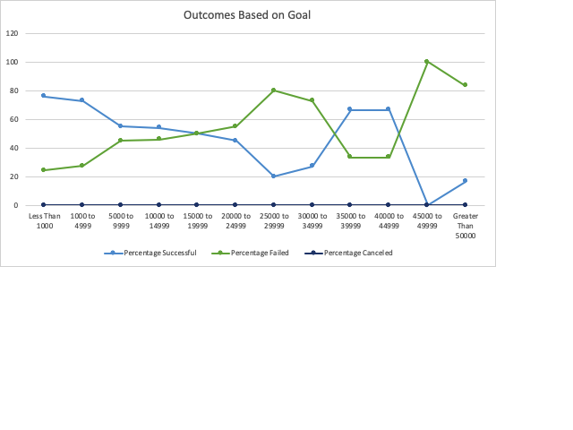
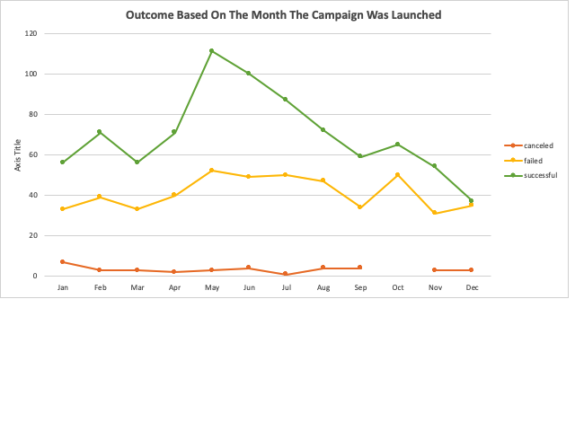

### Challenge: 1

# An Analysis of Kickstarter Campaigns

## Description of the project

Louise wants to start a crowdfunding campaign to help fund her play "Fever", with an estimated budget of $10,000 and she is hesitant jumping into the fundraising campaign without any knowledge of what characteristics will make her campaign successful. This project organizes, sorts and analyzes the crowdfunding data to determine whether there are specific factors that will make project campaign successful and what aspects will assist Louise to kick start her production.

## Results

After performing detailed analysis on the Kickstarter data in excel, one of the findings is to have a realist goal amount that needs to be raise from the fundraising campaign. This will make the campaign to be more prosperous, the following line chart shows that lower goal amounts have the higher success rate.

The time of the year the campaign takes place also contributes to its success. Most of the campaigns that did well were launched in the early summer, campaigns taking place during the winter time were less successful. The following line chart shows that most successful Kickstarter campaigns were started in May. On the other hand, December doesn’t seem like a great time to launch a campaign.

One of the factors that also affects the success of the fundraising campaign is the length of the campaign,the following line chart shows that the campaigns with a length of 30 days did far better than the campaigns that lasted longer or way too shorter. 

## Summary 

Based on the data analysis performed on the Kickstarter data I would recommend Louise should try to keep a realistic goal amount she wants to raise for her play "Fever" from the fundraising campaign to have greater chances of success. She should also make her campaign to have a shorter length (around 30 days) and she should also aim to launch her fundraising campaign during the summer time (May would be the best month). This will increase the probability that Louise will have a successful fundraising campaign for her play.

### Limitations of the dataset and suggestions

    The Kickstarter data contains data for the fundraising campaigns that were launched in 2009 to 2017, however, there is no data available for the campaigns that took place in 2018 and 2019. Recent data is missing because of which it is hard to tell if patterns in the data are still the same in todays time or not. (In this data it was visible that play category was pretty successful, but this could have changed now, there is no way to tell since we do not have data for the recent years).

    One suggested graph that helps make the analysis easier is to make the line chart for the duration of the campaign (the length the campaign lasted). This graph can be seen above which indicated that campaigns that lasted around 30 days were more successful than the others.